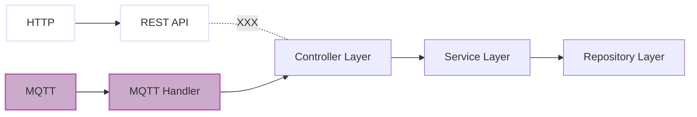

## **문제 개요**

기업 연계 프로젝트에서 설비 과정 중 IoT에서 검진한 데이터를 중앙 서버로 전송하는 기능을 맡았다.

환경 특성상, HTTP 프로토콜 대신 MQTT 프로토콜로 변경하기로 결정하였다.


본 포스팅에서는 MQTT 프로토콜로의 전환 과정 중 발생한 JPA의 `Detach Entity`와 `OSIV` 를 다루고자 한다.

---

## **문제 설명**


기존에는 REST API의 POST 요청을 통해 데이터를 전송하였다.

**MQTT 프로토콜로 변환**하면서 **기존의 Controller 메소드를 호출하여 재사용**하였다.

---

### 엔티티
사용된 엔티티는 `parent`, `child` 두 개로 다음과 같다.
> **이해를 돕기 위해 엔티티를 간소화하여 재현하였다.**
{: .prompt-info }


_ERD_


_Enitiy_

`parent`와 `child`는 **1 : N 관계**이다.


### **코드**

**MQTT payload 수신 코드**

```java
@RequiredArgsConstructor
public class MqttMessageHandler {

    private final ChildController childController;
    private final ObjectMapper objectMapper;

    @ServiceActivator(inputChannel = "mqttInputChannel")
    public void handleMessage(Message<?> message) {
        // Mqtt payload 수신
        String payload = (String) message.getPayload();

        try {
            // payload ChildDto 객체로 변환
            ChildDto childDto = objectMapper.readValue(payload, ChildDto.class);

            // 엔티티 저장 Controller 호출
            childController.saveChild(childDto);
        } catch (Exception e) {
            log.error("Error handling MQTT message: {}", e.getMessage(), e);
        }

    }
}
```

>  **코드 설명**
>
>  1. Mqtt 로 받은 payload 수신
>  2. payload를 Dto 객체로 변환
>  3. Conroller의 저장 로직 호출
{: .prompt-info }


**데이터 저장 로직**

```java
@RestController
@RequiredArgsConstructor
public class ChildController {

    private final ChildRepository childRepository;
    private final ParentRepository parentRepository;

    @GetMapping("/child/save")
    public void saveChild(@RequestBody @Valid ChildDto childDto) {
        // 요청 데이터로 부모 엔티티 조회
        Parent myParent = parentRepository.findById(childDto.getParentId()).orElse(null);

        // 요청 받은 dto로 자식 엔티티를 생성하고 부모 엔티티 연관 설정
        Child child = Child.builder()
            .name(childDto.getName())
            .parent(myParent)
            .build();

        // child 엔티티 저장
        Child save = childRepository.save(child);
    }
}
```

> **코드 설명**
>
> 1. 요청 데이터로 부모 엔티티 조회
>2. 요청받은 dto로 자식 엔티티를 생성하고 부모 엔티티 연관 설정
> 3. JPA Repository를 사용하여 자식 저장
{: .prompt-info }

**요청 흐름**



**MQTT 수신 코드만 작성하여 기존 Controller 메소드를 호출하였다.**

> Controller -> Service -> Repository 의 흐름을 유지하기 위해  
> MQTT payload를 받고 Controller의 메소드를 재사용하였다.
{: .prompt-info }


### **에러 발생**

MQTT를 통해  JSON을 전송하였다.


_MQTT 메시지 전송_


_Error log_

HTTP 요청은 정상 동작 하였지만

MQTT 요청은 `detached entity passed to persist` 오류가 발생하였다.


_에러 발생지점_

> 
> 로직 흐름은 다음과 같다.
> 1.  MQTT 로 데이터를 전송한다.
>
> 2. MqttMessageHandler에서 데이터를 수신한다.
>
> 3. 수신한 payload를 Dto로 변환한다.
>
> 4. Controller 메소드를 호출한다.
>
> 5. Dto의 Parent Id를 통해 Parent를 조회한다.
>
> 6. Dto의 name과 조회한 Parent를 연관 관계를 설정하고 새로운 Child를 생성한다.
>
> 7. 생성한 Child를 save() 메소드를 호출하여 저장한다.
{: .prompt-info }

## **원인 분석**

### **엔티티 영속 상태 확인**


_엔티티 영속 상태 확인_

**조회한 Parent가 영속 상태**인지 확인하는 코드**`em.contains(myParent)`** 를 추가하였다.

#### **MQTT 요청 결과**


_MQTT는 준영속 상태_

**MQTT 요청의 경우 조회한 Parent 객체가 준 영속 상태임을 확인하였다.**

이후 save() 메소드에서 `detached entity passed to persist` 에러를 출력했다.

> **MQTT - 준 영속(Detached) 상태**
>
> ```java
> em.contains(myParent)=false
> ```
{: .prompt-info }

#### **HTTP 요청 결과**


_HTTP는영속 상태_

**HTTP 요청의 경우 조회한 Parent 객체가 영속 상태임를 확인 할 수 있었다.**

이후 영속성 문제없이 저장한 Child와 연관된 Parent의 이름까지 조회할 수 있었다.

> **HTTP - 영속(Persistent) 상태**
>
> ```java
> em.contains(myParent)=true
> ```
{: .prompt-info }

### **왜 서로 다른 결과가 나올까?**

간단하게 말해서 영속성 컨텍스트에 객체가 없어서였다.

당시에는 프로젝트 마감에 집중하느라 정확한 원인 분석은 미루게 되었다.

MQTT는 Spring integration-mqtt를 통해 동작하였고 Spring이 Servelet, DI, 설정 등등 복잡하게 얽혀진 추상적인 프로젝워크라는 경험을 바탕으로 두 통신 간에 차이가 있음을 지레짐작하였을 뿐이다.

프로젝트 마무리 후, 최근 JPA를 공부하게 되면서 정확한 원인을 캐치할 수 있었다.

`OSIV` 가 그 원인이었다.


### **OSIV - Open Seesion In View**

`OSIV`는 **HTTP 요청 동안 영속성 컨텍스트를 열어두어, 지연 로딩을 가능하게 하는 방법이다.**

> Spring web request interceptor that **binds a JPA EntityManager to the thread** for the entire processing of the request. Intended for the “Open EntityManager in View” pattern, i.e. to allow for lazy loading in web views despite the original transactions already being completed.
>
>   [Srping Docs 참고](https://docs.spring.io/spring-framework/docs/current/javadoc-api/org/springframework/orm/jpa/support/OpenEntityManagerInViewInterceptor.html)


1. **HTTP 요청**
   * 클라이언트로부터 요청이 들어온다.
2. **영속성 컨텍스트 열림**
   * 해당 Thread에 영속성 컨텍스트를 바인딩해준다.
3. **비즈니스 로직 실행**
   * Service 계층에서 비즈니스 로직을 실행한다.
4. **뷰 렌더링**
   * Controller 계층에서 영속성 컨텍스트가 유지되기 때문에 Lazy 로딩이 가능하게 된다.
5. **종료**
   - HTTP 요청 처리 후 영속성 컨텍스트가 닫힌다.   

​     


> 스프링에서 OSIV는 기본적으로 활성화되어 있다.
> ```properties
> # application.properties
> spring.jpa.open-in-view=true
> ```
{: .prompt-info }

​	


HTTP 요청의 경우에는 OSIV를 통해 바인딩된 영속성 컨텍스트 덕분에 `detached entity passed to persist` 에러를 피해 갈 수 있었다.


#### **OSIV의 EntityManager 바인딩**

HTTP 요청이 들어오면`OpenEntityManagerInViewInterceptor`는  `preHandle()`로 요청을 가로채게 된다.

다음은 `preHandle()` 코드의 일부다.

```java
public void preHandle(WebRequest request) throws DataAccessException {
	...
	...
        EntityManagerFactory emf = this.obtainEntityManagerFactory();

        // EntityManagerFactory에 이미 바인딩 된 EntityManager가 있는지 확인
        if (TransactionSynchronizationManager.hasResource(emf)) {
            ...
        } else {
            this.logger.debug("Opening JPA EntityManager in OpenEntityManagerInViewInterceptor");
            try {
                EntityManager em = this.createEntityManager();
                
                // EntityManager를 EntityManagerHolder에 담음
                EntityManagerHolder emHolder = new EntityManagerHolder(em);
                
                // EntityManagerHolder를 EntityManagerFactory와 함께 현재 Thread에 바인딩
                TransactionSynchronizationManager.bindResource(emf, emHolder);
                ...
            }
        }
    }
}
```


1. 바인딩 된 EntityManager가 있는지 확인
   
2. 바인딩 된 EntityManager 가 없을 경우 새로운 EntityManager를 생성

3. Thread에 EntitiyManager를 바인딩


#### **OSIV의 EntityManager 얻기**

다음은 OSIV(Open Session in View)  Thread에 바인딩 된 트랜잭션을 얻는 과정이다.

```java
protected Object doGetTransaction() {
    ...
    // Thread에 바인딩한 EntityManager를 꺼낸다.
    EntityManagerHolder emHolder = (EntityManagerHolder)TransactionSynchronizationManager
        .getResource(this.obtainEntityManagerFactory());
    if (emHolder != null) {
        if (this.logger.isDebugEnabled()) {
            this.logger.debug("Found thread-bound EntityManager [" + emHolder.getEntityManager() + "] for JPA transaction");
        }

        // 트랜잭션 관리 객체에 EntityManager를 설정해 준다.
        txObject.setEntityManagerHolder(emHolder, false);
    }
    
	...
    return txObject;
}
```


1. Thread에  EntityManager를 가져옴
3. 트랜잭션 관리 객체에 EntityManager설정


>  **EntityManagerHolder**
>
>  setEntityManagerHolder()의 두 번째 파라미터는 **새로 생성된 EntityManagerHolder인지 여부**를 나타냄
>
>  **이 값()에 따라 EntityManager의 소멸 여부가 결정됨**
>
>  **OSIV** - False
>
>  **@Transactional** - True
{: .prompt-info }

#### **OSIV의 EntityManager 소멸**

HTTP 요청에 대해 뷰가 렌더링 된후 `OpenEntityManagerInViewInterceptor`의 `afterCompletion()`에 의해EntityManager가 소멸된다.

다음은 `afterCompletion()` 코드의 일부다.

```java
public void afterCompletion(WebRequest request, @Nullable Exception ex) throws DataAccessException {
	//트랜잭션 소멸 여부확인
    if (!this.decrementParticipateCount(request)) {
        
        // Thread에 바인딩 된 EntitiyManager를 해제
        EntityManagerHolder emHolder = (EntityManagerHolder).unbindResource(this.obtainEntityManagerFactory());
        
        // EntityManager를 닫는 로그 출력
        this.logger.debug("Closing JPA EntityManager in OpenEntityManagerInViewInterceptor");
        
        // EntityManager 닫기
        EntityManagerFactoryUtils.closeEntityManager(emHolder.getEntityManager());
    }
}

```

1. HTTP 요청이 완료된 후`afterCompletion()` 메소드가 호출
2. 트랜잭션 소멸 여부 확인
   - 만약 참여 카운트가 0이 아니라면 메서드를 종료
3. Thread에 바인딩된 EntitiyManager를 해제

>  OSIV의 EntityManager 소멸은 인터셉터의 `afterCompletion()` 메서드에서 수행된다.
>
>  이는 Controller 로직 실행 후 호출되어 요청 동안 영속성 컨텍스트를 유지할 수 있다.
{: .prompt-info }


**@Transctional 의 EntityManager 소멸**

**@Transactional** 애노테이션을 사용한 EntityManager 소멸 과정은 다음과 같다.

```java
protected void doCleanupAfterCompletion(Object transaction) {
    ...
    // 새로 생성된 EntityManagerHolder인지 확인
    if (txObject.isNewEntityManagerHolder()) {
        // EntityManager를 가져옴
        EntityManager em = txObject.getEntityManagerHolder().getEntityManager();
        if (this.logger.isDebugEnabled()) {
            // EntityManager를 닫는 로그 출력
            this.logger.debug("Closing JPA EntityManager [" + em + "] after transaction");
        }

        // EntityManager 닫기
        EntityManagerFactoryUtils.closeEntityManager(em);
    } else {
        // 이전에 바인딩 된 EntityManager를 닫지 않는 로그 출력
        if (this.logger.isDebugEnabled()) {
            this.logger.debug("Not closing pre-bound JPA EntityManager after transaction");
        }
    }
    ...
}
```

**EntityManagerHolder**의 값에 따라 EntityManager 소멸 여부가 결정된다.

- `@Transactional`의 경우 (EntityManagerHolder - True)
- **로그 출력**: `Closing JPA EntityManager [SessionImpl(123456789<open>)] after transaction`


  - **작업** : EntityManagerFactoryUtils를 통해 EntitiyManager를 닫는다.


- `OSIV`의 경우 (EntityManagerHolder - False)
  - **로그 출력**: `Not closing pre-bound JPA EntityManager after transaction`
  - **작업**: 로그만 출력하고 EntitiyManager를 닫지 않는다.

​	


### **로그분석**

이전 HTTP 요청의 로그를 따라 `EntitiyManager`의 라이프 사이클을 확인해 보겠다.


_로그 출력 코드 추가_

DB에 접근하는 `findById()` , `save()` 메소드의 호출 시점과 종료 시점에 로그 출력 코드를 추가하였다.


_HTTP 요청 로그_

HTTP 요청 로그를 살펴보겠다.

#### **1. HTTP 요청**


_HTTP 요청을 받은 후 EntitiyManager를 Thread에 바인딩 해준다._

1. **로그 출력**: `Opening JPA EntityManager in OpenEntityManagerInViewInterceptor`
   - OpenEntityManagerInViewInterceptor에 의해 Thread에 EntitiyManager가 바인딩 된다.

#### **2. Spring Data JPA - `findById() 호출`**


_Thread에 바인딩 된 EntitiyManager를 사용한다._

1. **로그 출력**: `Found thread-bound EntityManager [SessionImpl(1226642971<open>)] for JPA transaction`
   - JpaTransactionManager에서 Thread에 바인딩된 EntitiyManager를 꺼낸다.

2. **로그 출력**: `Not closing pre-bound JPA EntityManager after transaction`
   - OSIV에 의해 바인딩 된 EntitiyManager는 소멸 되지 않는다.

#### **3. Spring Data JPA - `save() 호출`**


_Thread에 바인딩 된 EntitiyManager를 사용한다._

1. **로그 출력**: `Found thread-bound EntityManager [SessionImpl(1226642971<open>)] for JPA transaction`

   - **이전 사용되었던 `SessionImpl(1226642971<open>` 이 동일하게 사용되었다.**

     

2. **로그 출력**: `Not closing pre-bound JPA EntityManager after transaction`

   - 위와 동일하게 EntitiyManager가 소멸 되지 않았다..

#### **4. EntitiyManager 소멸**


_save()요청을 마치고 소멸된 EntityManager_

1. **로그 출력** : `Closing JPA EntityManager in OpenEntityManagerInViewInterceptor`
   - OpenEntityManagerInViewInterceptor의 afterCompletion() 에 의해 뷰가 렌더링 된 후에 호출되어EntityManager를 소멸시킨다.


#### **MQTT 요청**


_다른 Session객체를 사용한 MQTT 요청._

MQTT 요청의 경우 OSIV가 동작하지 않아, JpaRepository에 접근할 때마다 매번 새로운 영속성 컨텍스트가 열리고 닫히면서 다른  Session 객체가 사용되었다.

그 결과 **영속성 컨텍스트가 유지가 되지 않아 조회한 객체는 `준 영속(Detached)` 상태가 되어 에러를 발생하였다.**


### **마무리**

프로젝트는 마무리되었지만, 문제 원인에 대한 호기심으로 블로그를 포스팅하게 되었다.

영속성 컨텍스트, OSIV, 연관관계 등을 학습하며 JPA에 대한 시야를 넓힐 수 있었다.
