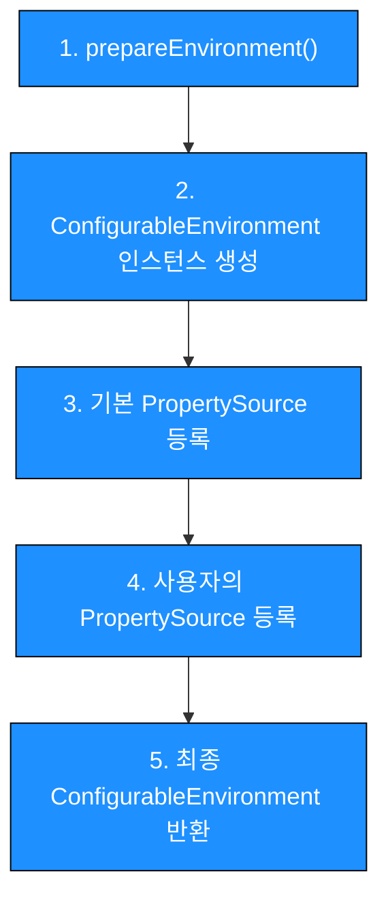

> 현재 개발 중인 커스텀 프레임워크인 **WinterFramework**에는 프로퍼티를 주입하는 기능이 없어, Spring Framework에서 제공하는 프로퍼티 주입 방식을 먼저 분석하게 되었습니다.
>
> 이 시리즈에서는 Spring이 프로퍼티를 어떻게 관리하고, 이를 통해 `@Value` 등으로 값을 주입하는 흐름을 단계별로 살펴보며, WinterFramework에 직접 적용하는 과정을 정리할 예정입니다.
>
> - **1편**: **Spring 프로퍼티 등록 과정 분석 (현재 포스팅)**
> - **2편**: Spring 프로퍼티 프로퍼티 조회 과정 분석 
> - **3편**: WinterFramework에 프로퍼티 적용하기 (Spring 프로퍼티)


# Spring 프로퍼티 주입이란?

`application.properties`나 `application.yml` 등에 정의된 키·값을 런타임 시점에 빈(Bean)으로 주입할 수 있도록 지원하는 기능이다.

주로 사용되는 프로퍼티는 다음과 같다.:
- `server.port`
- `spring.datasource.url`

그럼 실제로 프로퍼티 주입이 어떻게 동작하는지 확인해보겠다.

## 스프링의 프로퍼티 주입 예제
아래 예제는 @Value로 프로퍼티 값을 컨트롤러에 주입한 뒤, REST API로 조회하는 간단한 예제이다.

###  1)  프로퍼티 등록

    _프로퍼티 설정 파일 예시_
properties, yml 파일에 키:값을 등록해 두면, 스프링을 통해 해당 값을 주입받을 수 있다.

### 2) 컨트롤러 코드 작성

    _값을 주입받는 예제 코드_
`@Value("${test.value}")`를 사용해 프로퍼티 값을 주입받는다.

###  3) 실행 결과

    _실행 결과_
위 결과에서`@Value` 어노테이션이 프로퍼티 값을 정상적으로 주입했음을 확인할 수 있다.

<br>

이처럼 스프링의 프로퍼티 주입을 활용하면 다음과 같은 이점을 얻을 수 있다.

1. **변경 범위 최소화**  
   설정값을 코드와 분리하여 **코드 수정 없이** 변경할 수 있어 변경 범위를 최소화

2. **민감 정보 보호**  
   민감한 정보를 별도 파일로 분리해 **외부 노출을 최소화**

3. **환경별 설정 분리**  
   개발·테스트·운영 등 각 환경에 맞는 **프로퍼티 파일을 분리해 관리**


## Spring 프로퍼티 등록 구조
### **1. SpringApplication 실행 전체 흐름**

   ```java
   public ConfigurableApplicationContext run(String... args) {
    // 1) Environment 생성
    ConfigurableEnvironment environment = this.prepareEnvironment(listeners, bootstrapContext, applicationArguments);
   
    // 2) ApplicationContext 생성
    context = this.createApplicationContext();
    // 3) 생성된 Environment를 Context에 바인딩
    this.prepareContext(bootstrapContext, context, environment, listeners, applicationArguments, printedBanner);
   
    // 4) BeanDefinition 등록 및 Bean 전처리 수행(BeanFactoryPostProcessor)
    this.refreshContext(context);
       
    // 5) 모든 Bean에 대해 의존성 주입(populateBean)후 싱글톤으로 인스턴스화  
    this.afterRefresh(context, applicationArguments);
   }
   ```

   > **`SpringApplication.run()`**은 Spring Boot 애플리케이션의 진입점으로,  
   > **`ConfigurableEnvironment`**·**`ApplicationContext`** 생성, Bean 등록 및 초기화 작업 등을 수행한다.
   {: .prompt-info }

   SpringApplication의 실행 초기에 **`prepareEnvironment()`**를 실행하여 **`ConfigurableEnvironment`**를 생성한다. 생성된 **`ConfigurableEnvironment`**는 **`ApplicationContext`**에 바인딩 되어, Bean 초기화 시 프로퍼티 값을 주입할 준비를 마친게 된다.

**`ConfigurableEnvironment`**는 프로퍼티를 관리하는 저장소로, 필요한 프로퍼티를 조회할 수 있는 핵심 역할을 한다. 이를 초기화하는 **`prepareEnvironment()`** 메서드가 어떻게 동작하는지 살펴보자.

​      

### **2. Environment 생성 및 PropertySource 등록 과정**
자세히 들어가기에 앞서, 아래 다이어그램은 **`prepareEnvironment()`** 호출 이후 **`ConfigurableEnvironment`**가 단계별로 구성되는 흐름을 시각화한 것이다.


이제 각 단계별로 어떤 로직이 실행되는지 간단히 살펴보겠다.

​    

#### **2-1. Environment 인스턴스 생성**

먼저 **`getOrCreateEnvironment()`**를 통해 **`Environmeat`**의 생성자를 호출한다.


> 이 과정에서 애플리케이션 종류에 맞는 **`Environment`**의 구현체를 선택한다.
> 
> 서블릿 기반 애플리케이션이라면 **`ApplicationServletEnvironment`**가 생성된다.
{: .prompt-info }


생성된 **Environment** 인스턴스는 이후 애플리케이션 전체에서 구성 정보를 관리하고, 프로퍼티 값을 읽어오는 핵심 역할을 담당하게 된다. 구체적으로 어떤 구조와 책임을 가지는지 살펴보면 다음과 같다.

##### **Environment의 역할**
- propertySources를 관리  
- 프로퍼티 값을 조회하는 기능 제공  

##### **주요 멤버**  
- **MutablePropertySources propertySources**  
  - **PropertySource<?>** 타입을 저장하는 리스트  
  - 다양한 프로퍼티 값(시스템 환경변수, 프로퍼티 파일등)을 제네릭 타입(`PropertySource`)으로 래핑하여 관리  
  - 등록된 여러 종류의 프로퍼티 소스를 순차적으로 조회하여 값 반환
- **PropertyResolver propertyResolver**  
  - 프로퍼티 값을 조회하고 치환하는 역할


    _AbstractEnvironment 클래스 주요 멤버_
<br>

#### **2-2. 시스템 프로퍼티/환경변수 기본 등록**

Environment 생성자 내부에서는  **JVM 시스템 프로퍼티와 OS 환경 변수가 PropertySource로 래핑된 후,  `MutablePropertySources` 에 저장된다.**


> 1. **JVM 시스템 프로퍼티** - *System.getProperties()*
> 2. **OS 환경 변수** - *System.getenv()*

​     

#### **2-3. 사용자 프로퍼티 파일 등록**

이 과정에서는 파일을 읽어 **`PropertySource<T>`**로 래핑한 후, **생성된 PropertySource를 Environment의 MutablePropertySources 에 추가하게 된다.**

핵심 흐름은 다음 두 단계로 나뉜다.

##### (1). **프로퍼티 파일 Resolve & Load**   - _ConfigDataImporter#resolveAndLoad()_
   1. **_메타데이터 수집 (Resolve)_**
      - 프로퍼티 파일의 메타정보(경로·우선순위 등) 수집  

   2. _**프로퍼티 파일 로드 (Load)**_
      - Resolve 결과(메타정보) 목록을 바탕으로 `.properties`/`.yml` 파일을 실제로 읽기 
      - PropertySourceLoader를 통해 읽어 들인 값을 `PropertySource` 객체로 생성하여 반환

##### (2). **Load한 결과를 Environment에 반영** - _ConfigDataEnvironment#applyToEnvironment()_
   - (1) _프로퍼티 파일 Resolve & Load_ 에서 생성된 `PropertySource` 목록을 순서대로 `Environment.MutablePropertySources`에 추가  
   - 최종적으로 모든 프로퍼티가 `Environment`에 등록됨

이 과정을 통해 모든 프로퍼티 소스가 병합되어, 최종 `Environment` 객체에 반영된다.

​    


### **4. 최종 Environment 반환 및 Context 바인딩**

- 반환된 `Environment`는 이후 `SpringApplication.run()` 내부 `prepareContext(...)`에서 `ApplicationContext`에 바인딩 되어,
  빈 생성 시점에 `@Value`나 `@ConfigurationProperties` 등으로 참조할 수 있도록 준비한다.

     ```
     context.setEnvironment(environment);
     ```

​    

지금까지 스프링의 **프로퍼티 등록 과정**을 살펴보았다 다음 편에서는 등록된 프로퍼티를 조회하는 기능을 알아보겠다.